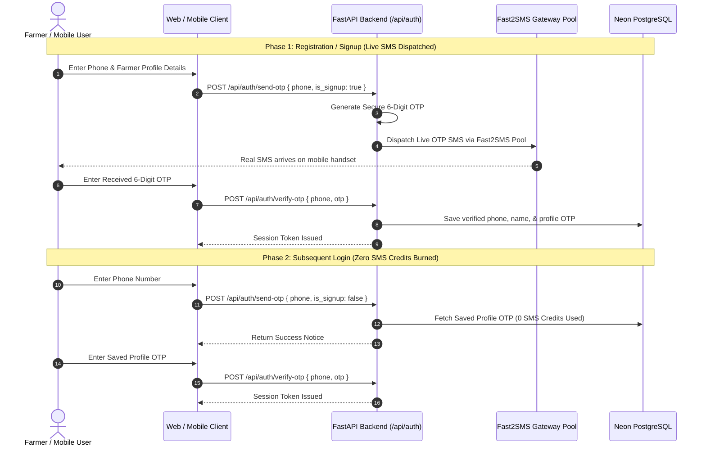

# 🔌 SkyView Backend API Overview

The SkyView platform is powered by a high-throughput, asynchronous FastAPI backend. The API handles real-time IoT telemetry, AI agricultural reasoning, user authentication, and marketplace barter transactions.

---

## 🌐 Server Base URLs

| Environment | Base URL | Access |
| :--- | :--- | :--- |
| **Production (Render)** | `https://brics-agrin-platform.onrender.com` | Public HTTPS |
| **Local Development** | `http://localhost:8000` | Localhost |
| **Frontend Production** | `https://skyview-ai.vercel.app` | Public Web App |

---

## 🔐 Authentication & Session Flow

SkyView utilizes passwordless mobile phone authentication designed for accessibility and operational cost efficiency:



### Fast2SMS Key Pool Failover
The backend supports comma-separated API keys via `FAST2SMS_API_KEY`:
```env
FAST2SMS_API_KEY=key_alpha,key_beta,key_gamma
```
If `key_alpha` runs out of credits or encounters an HTTP error, the system automatically fails over to `key_beta` and `key_gamma` sequentially without dropping the user's SMS request.
