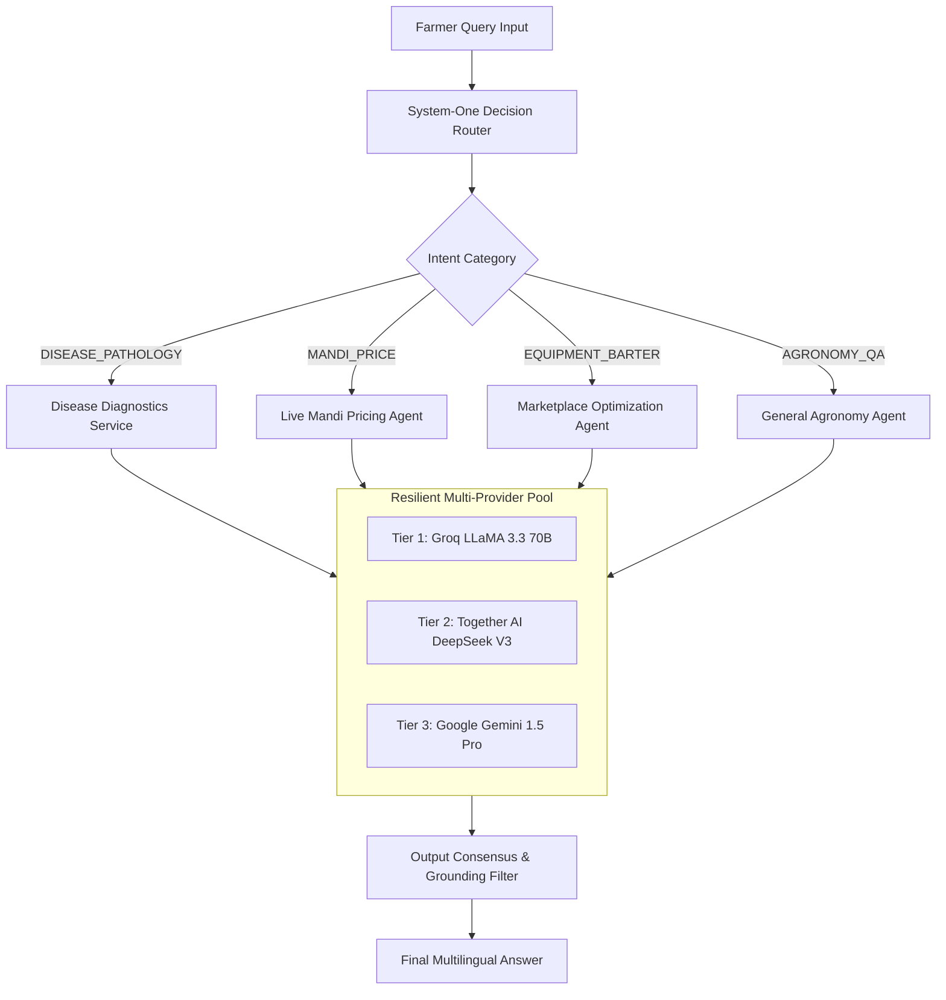

# 🧠 Multi-Tier AI Consensus Mesh

SkyView AG-RIN replaces monolithic LLM dependencies with a resilient **Multi-Tier Model Pool and Consensus Network**. This architecture ensures continuous, highly available agricultural reasoning even during upstream provider rate limits or outages.

---

## 🔀 System-One Decision Router

Every incoming farmer query is first evaluated by the **Decision Router** (`skyview/agents/decision_router.py`), which uses zero-shot intent categorization and confidence scoring:

---

## 🛡️ Model Failover Hierarchy

The LLM pool manager (`skyview/utils/llm_pool.py`) maintains real-time health checks on configured API endpoints:

1. **Primary Worker:** Groq Cloud (`llama-3.3-70b-versatile`)
   - Latency target: `< 500 ms`
   - Role: Fast, conversational dialogue in Hindi, Marathi, Telugu, Tamil, and English.
2. **Secondary Worker:** Together AI (`deepseek-ai/DeepSeek-V3`)
   - Latency target: `~1.2 s`
   - Role: Complex graph traversal arbitration for 3-party circular barter loops and fertilizer stoichiometry calculations.
3. **Tertiary Worker:** Google DeepMind Gemini (`gemini-1.5-pro` / `gemini-1.5-flash`)
   - Latency target: `~1.5 s`
   - Role: Multimodal crop pest vision analysis and regional Indian dialect understanding.
4. **Deterministic Local Fallback:**
   - In total network isolation, rule-based agronomic heuristics compiled from ICAR (Indian Council of Agricultural Research) standards provide actionable recommendations.
