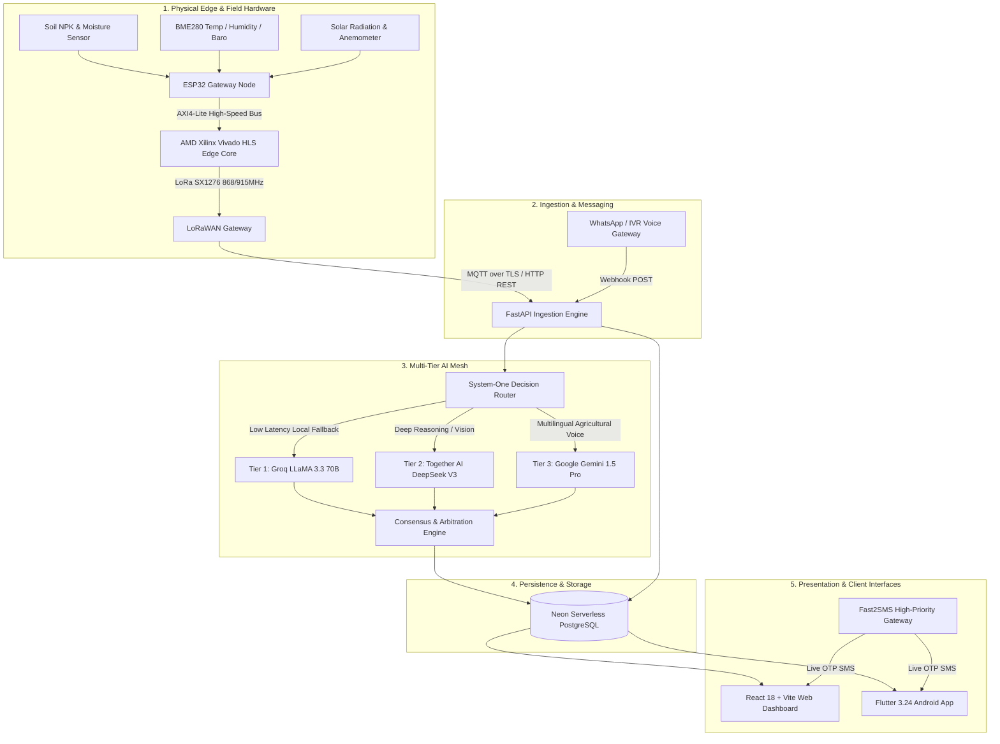

# 🏛️ SkyView System Architecture & Topology

The **SkyView AG-RIN** platform is a resilient, edge-to-cloud agricultural intelligence system designed to empower smallholder farmers across India and the BRICS agricultural corridor.

---

## 🌐 End-to-End System Topology

---

## 🧩 Architectural Subsystems

### 1. Edge & FPGA Layer
- **Hardware Platform:** Custom **AgriSense WS01** micro-weather and soil monitoring station.
- **Microcontroller:** Espressif ESP32-WROOM-32 with LoRa SX1276 telemetry.
- **Hardware Acceleration:** AMD Xilinx Vivado HLS fixed-point compute core performing real-time agricultural index calculations:
  - Evapotranspiration ($ET_0$) via Penman-Monteith equation.
  - Heat stress and vapor pressure deficit (VPD).
  - Crop disease risk heuristic indexes with sub-millisecond latency.

### 2. High-Performance FastAPI Backend
- **Engine:** Python 3.11 with asynchronous ASGI architecture.
- **Route Modules (18 Core Endpoints):**
  - `/api/auth`: Phone OTP authentication with live Fast2SMS SMS dispatch and credit-saving profile caching.
  - `/api/sensors`: Real-time weather, soil NPK, and historical telemetry queries.
  - `/api/advisor`: Agricultural QA advisory mesh with automated crop advice generation.
  - `/api/mandi`: Real-time commodity price tracking and mandi rate feeds from `data.gov.in`.
  - `/api/fpga`: Edge FPGA health telemetry, register diagnostics, and synthesis verification.
  - `/api/marketplace`: Bilateral and 3-party circular barter loops with AI deal brokers.
  - `/api/disease`: Crop pathology vision diagnosis and treatment guidelines.
  - `/api/profile`: Farmer land size, district, and crop tracking.

### 3. Multi-Tier AI Mesh Consensus
- Designed for zero-single-point-of-failure operation with multi-provider failover:
  1. **Groq LLaMA 3.3 70B Versatile:** Sub-400ms ultra-low latency response for real-time field Q&A.
  2. **Together AI DeepSeek V3:** Advanced logical arbitration for complex multi-party barter schedules.
  3. **Google Gemini 1.5 Pro:** Multilingual voice transcription, vision diagnosis, and regional language reasoning.

### 4. Client Ecosystem
- **Web Application:** React 18, Vite, TypeScript, Tailwind CSS, Lucide icons, Framer Motion, and Recharts.
- **Mobile Application:** Flutter 3.24 (Dart 3.5.3), Riverpod state management, voice-first speech-to-text, and offline Hive caching.
