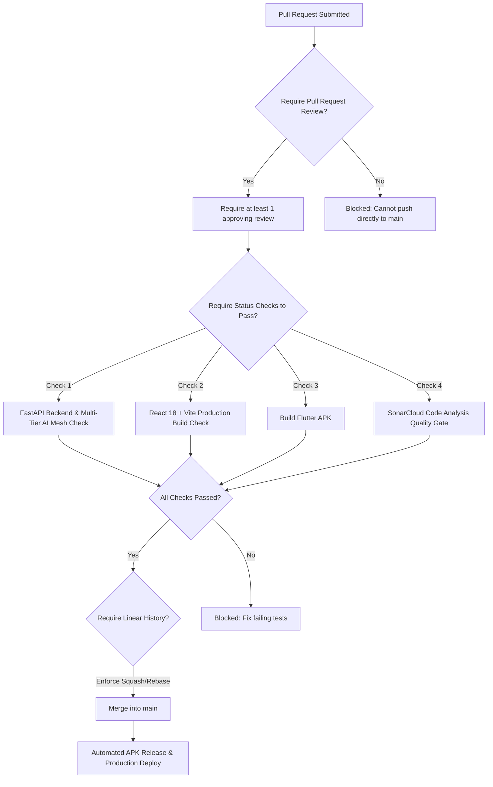

# 🛡️ GitHub Branch Protection Rules Guide

To protect production stability and prevent unauthorized or untested code from landing on `main`, repository maintainers must configure **Branch Protection Rules** on GitHub.

---

## 🎯 Recommended Branch Protection Policy for `main`

The following settings should be enforced on the `main` branch:



---

## 🛠️ Step-by-Step Configuration on GitHub

1. Navigate to your repository: `https://github.com/vvinayakkk/skyview-ai`
2. Click **Settings** ➔ **Branches** (in the left sidebar).
3. Under **Branch protection rules**, click **Add branch ruleset** or **Add rule**.
4. Set **Branch name pattern** to: `main`.
5. Enable the following checkboxes:
   - ✅ **Require a pull request before merging:**
     - Set *Required approvals*: `1`.
     - Check *Dismiss stale pull request approvals when new commits are pushed*.
   - ✅ **Require status checks to pass before merging:**
     - Check *Require branches to be up to date before merging*.
     - Under the search box, add the following required status check names:
       - `FastAPI Backend & Multi-Tier AI Mesh Check`
       - `React 18 + Vite Production Build Check`
       - `Build Flutter APK`
       - `SonarCloud Code Analysis`
   - ✅ **Require linear history:** Enforces clean git history (preventing merge commits).
   - ✅ **Do not allow bypassing the above settings:** Enforces rules for administrators as well.
   - ❌ **Allow force pushes:** Disabled (uncheck).
   - ❌ **Allow deletions:** Disabled (uncheck).
6. Click **Save changes** (confirm with your GitHub password / 2FA).

---

## 💻 Applying via GitHub CLI / API

Repository administrators can also apply branch protection rules programmatically:

```bash
gh api --method PUT /repos/vvinayakkk/skyview-ai/branches/main/protection \
  -H "Accept: application/vnd.github+json" \
  --input - <<EOF
{
  "required_status_checks": {
    "strict": true,
    "contexts": [
      "FastAPI Backend & Multi-Tier AI Mesh Check",
      "React 18 + Vite Production Build Check",
      "Build Flutter APK"
    ]
  },
  "enforce_admins": true,
  "required_pull_request_reviews": {
    "dismiss_stale_reviews": true,
    "require_code_owner_reviews": false,
    "required_approving_review_count": 1
  },
  "restrictions": null,
  "allow_force_pushes": false,
  "allow_deletions": false
}
EOF
```
