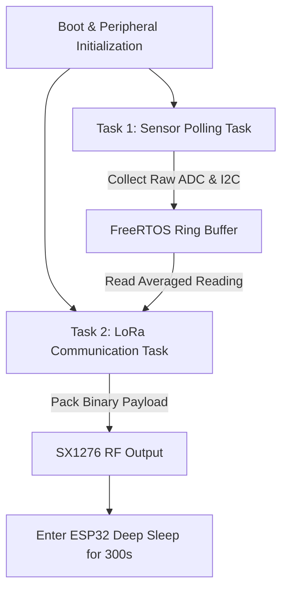

# 📡 ESP32 Firmware & LoRa Packet Protocol

The AgriSense WS01 firmware is implemented in C++ using the Arduino Core for ESP32 and FreeRTOS tasks.

---

## 🏗️ Firmware Task Architecture



---

## 📦 LoRa Binary Payload Schema

To minimize airtime and comply with regional duty cycle limits (1% duty cycle in India 865-867MHz and EU 868MHz), data is packed into a high-density 18-byte binary struct:

```cpp
struct __attribute__((packed)) AgriTelemetryPacket {
    uint16_t station_id;     // 2 Bytes: Unique station integer ID
    uint32_t unix_timestamp; // 4 Bytes: UTC Epoch time
    int16_t  temp_c_x100;    // 2 Bytes: Temperature in °C * 100 (-4000 to +8500)
    uint16_t hum_pct_x100;   // 2 Bytes: Relative Humidity % * 100 (0 to 10000)
    uint16_t soil_vwc_x100;  // 2 Bytes: Soil Volumetric Water Content % * 100
    uint16_t rain_mm_x100;   // 2 Bytes: Accumulated rain in mm * 100
    uint16_t battery_mv;     // 2 Bytes: Battery Voltage in mV (3000 to 4200)
    uint16_t crc16;          // 2 Bytes: CCITT-FALSE CRC checksum
};
```

---

## 🚀 Flashing the Firmware

### Using PlatformIO (Recommended)
1. Navigate to the hardware directory:
   ```bash
   cd hardware/firmware
   ```
2. Build and upload via USB:
   ```bash
   pio run -t upload
   ```
3. Monitor serial output (115200 baud):
   ```bash
   pio device monitor -b 115200
   ```
