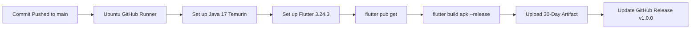

# 🔄 Automated Mobile CI/CD & GitHub Releases

The SkyView platform automates the entire mobile compilation lifecycle through GitHub Actions (`.github/workflows/build-apk.yml`).

---

## ⚡ Continuous Release Workflow

Every time a commit is pushed to the `main` branch:



### 1. Artifact Retention
The compiled `app-release.apk` is saved as a downloadable build artifact named `skyview-agrin-release-apk` retained for 30 days.

### 2. GitHub Release Binary Update
The workflow leverages `softprops/action-gh-release@v2` with `permissions: contents: write` to automatically update the official release tagged `v1.0.0` at:
```
https://github.com/vvinayakkk/skyview-ai/releases/tag/v1.0.0
```
Users and field agronomists can always download the latest compiled APK directly from GitHub Releases without needing local compilation tools.
